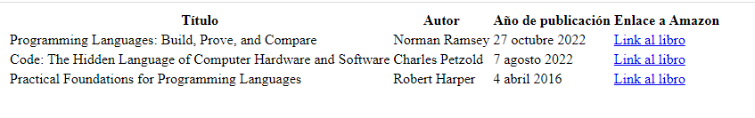

# OB_Curso_de_HTML_y_CSS
## Unidad 2 - Ejercicio 2

```
Crea un nuevo documento HTML que cumpla los siguientes parámetros:

- El título debe ser "Ejercicio 02/2 - Tablas en HTML"

- El body debe contener una tabla que cumpla las siguientes características
    - Las columnas serán las siguientes: "Título", "Autor", "Año de publicación", "Enlace a Amazon"
    - Debe tener tres entradas, que corresponderán a tus tres libros favoritos
```
### Ejercicio Print de Pantalla:


