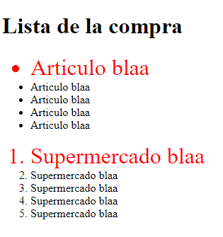

# OB_Curso_de_HTML_y_CSS
## Unidad 4 - Ejercicio 1

```
Crea un nuevo documento HTML que cumpla los siguientes parámetros:

- Debe estar dividido en tres secciones (etiqueta)

- Condiciones para la primera sección
    - Debe tener un título (h1) indicando "Aprendiendo a utilizar imágenes"
    - Debes incluir una imagen de tu videojuego favorito
```
### Ejercicio Print de Pantalla:


