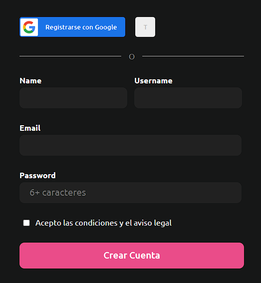

# OB_Curso_de_HTML_y_CSS
## Unidad 7 - Ejercicio 1

```
Replica el ejercicio del vídeo 3 de esta sesión y realiza el siguiente cambio:

- Replícalo exactamente igual, pero realiza una nueva versión en modo oscuro
- Los colores serán los siguientes
    - El rosa se queda igual
    - El fondo blanco será sustituido por el color #161717
    - El fondo de los inputs tendrá un color #212121
    - El fondo de los inputs cuando se hace hover será del color #454045
    - Los textos tendrán un color blanco
```
### Ejercicio Print de Pantalla:


