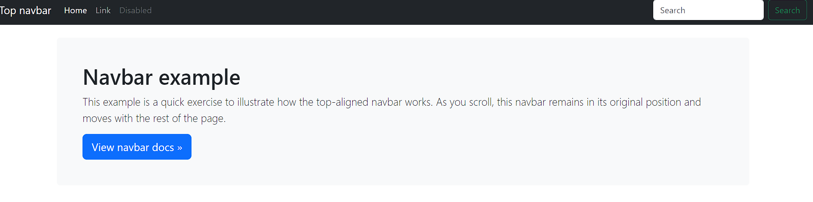

# OB_Curso_de_HTML_y_CSS
## Unidad 8 - Ejercicio 1

```
Crea un nuevo documento HTML con el título "Introducción a Bootstrap"

Utilizando la página oficial getbootstrap.com, añade la última versión de Bootstrap a este documento HTML
```
### Ejercicio Print de Pantalla:


