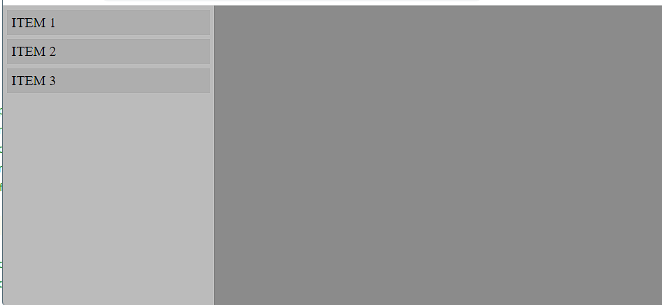
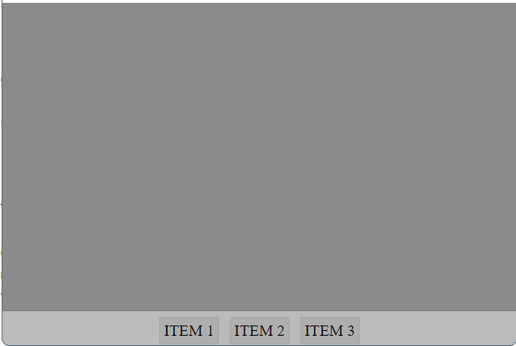

# OB_Curso_de_HTML_y_CSS
## Unidad 9  - Ejercicio 1

```
Crea un nuevo documento HTML con el título "Diseño Responsive con CSS"

- Crea un nuevo fichero CSS e impórtalo en el documento HTML principal
- Crea las siguientes dos secciones:
 - Una barra lateral izquierda con tres elementos en vertical
 - Una sección principal a la derecha
 - (Tip: Utiliza la disposición flex donde la sección principal utilizará flex-grow)

- Utiliza las media queries para que cuando el ancho del viewport sea menor de 640px ocurra lo siguiente:
 - La barra lateral izquierda se muestre como una navegación en la parte inferior
 - La disposición de los elementos de la barra lateral se vuelva horizontal
 - (Tip: Trabaja con la propiedad flex-direction)
```
### Ejercicio Print de Pantalla:



### Pantalla menor a 640px:

